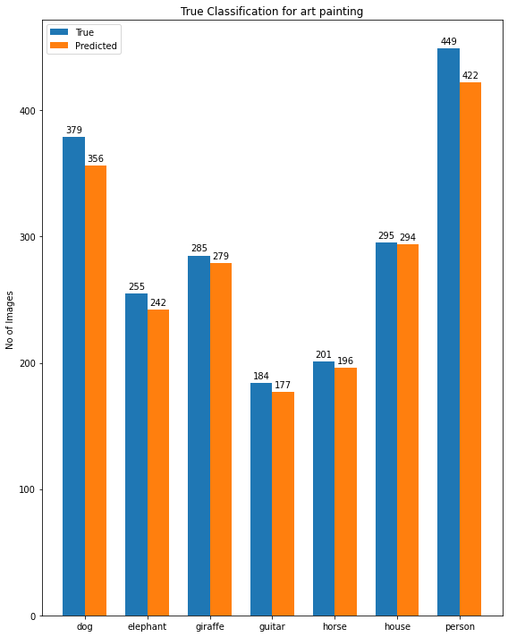
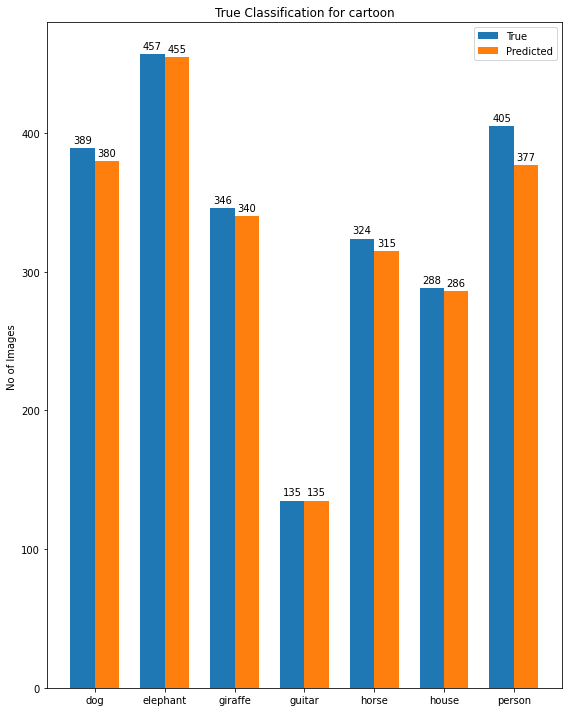
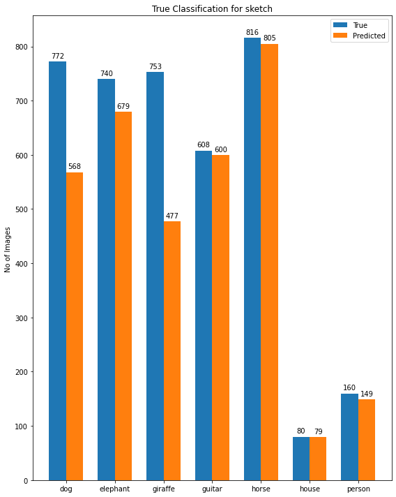

# Clip Evaluation on PACS dataset

Table of contents
=================

<!--ts-->

* [Introduction](#introduction)
* [Installation](#installation)
* [Results](#results)

<!--te-->

# Introduction

An exploration of PACS dataset on Clip ViT-B/32 model on Zero Shot Classification. 

# Installation

Run the notebook on the Google Colab or locally with GPU, I wasn't able to evaluate 
on all the different domains due to limitation of GPU memory. 
Note: Running on CPU will takes a lot of time.

# Results

Below are the initial results for the true and prediction label counts on trying on different domains. 
As expected the `Sketch` domain due to its complexity in nature it didn't performed well as compared with other 
domains.  

Art Painting

Cartoon

Photo

Sketch

